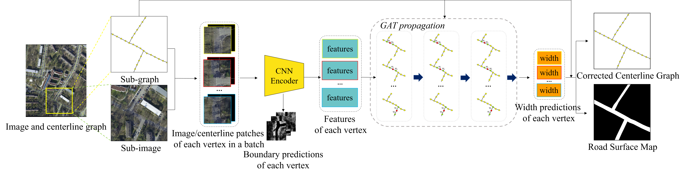

# Road-Width-Detector

This repository is the official implementation of  [A Combination of Convolutional and Graph Neural Networks for Regularized Road Surface Extraction](https://ieeexplore.ieee.org/abstract/document/9714410)

## Abstract

Road surface extraction from high-resolution remote sensing images has  many engineering applications; however, extracting regularized and  smooth road surface maps that reach the human delineation level is a  very challenging task, and substantial and time-consuming manual work is usually unavoidable. In this article, to solve this problem, we propose a novel regularized road surface extraction framework by introducing a  graph neural network (GNN) for processing the road graph that is  preconstructed from the easily accessible road centerlines. The proposed framework formulates the road surface extraction problem as two-sided  width inference of the road graph and consists of a convolutional neural network (CNN)-based feature extractor and a GNN model for vertex  attribute adjustment. The CNN extracts the high-level abstract features  of each vertex in the graph as the input of the GNN and also the road  boundary features that allow us to distinguish roads from the  background. The GNN propagates and aggregates the features of the  vertices in the graph to achieve global optimization of the regression  of the regularized widths of the vertices. At the same time, a biased  centerline map can also be corrected based on the width prediction  result. To the best of the authors' knowledge, this is the first study  to have introduced a GNN to regularized human-level road surface  extraction. The proposed method was evaluated on four diverse datasets,  and the results show that the proposed method comprehensively  outperforms the recent CNN-based segmentation methods and other  regularization methods in the intersection over union (IoU) and  smoothness score, and a visual check shows that a majority of the  prediction results of the proposed method approach the human delineation level.

## Pipeline



## Prepare dataset

See `prepare-dataset/prepare-data.sh`

## Train

```python
python train-and-evaluate/train.py
```

## Evaluate

```python
python train-and-evaluate/evaluate.py
```

## Road surface map generation

```python
python post-processing/postprocessing.py
```


## Citation

If you find our work useful in your research, please cite:

```
@ARTICLE{9714410,
  author={Yan, Jingjing and Ji, Shunping and Wei, Yao},
  journal={IEEE Transactions on Geoscience and Remote Sensing}, 
  title={A Combination of Convolutional and Graph Neural Networks for Regularized Road Surface Extraction}, 
  year={2022},
  volume={60},
  number={},
  pages={1-13},
  doi={10.1109/TGRS.2022.3151688}}
```

